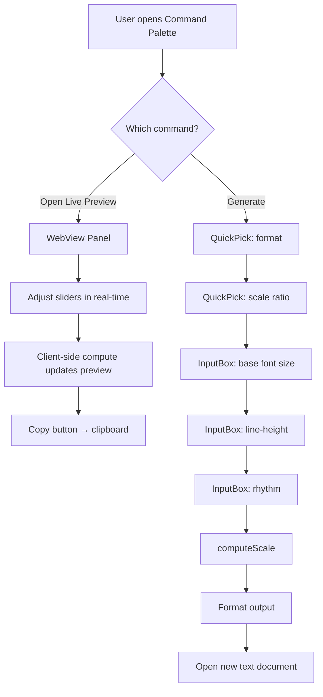
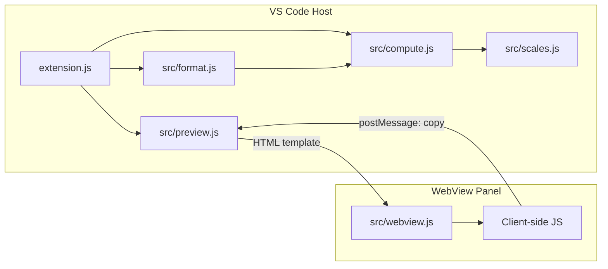
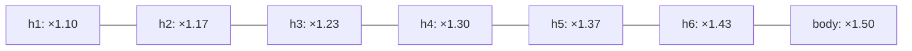

# Rhythm & Scale

A VS Code extension that generates a **modular typographic scale** with line-heights snapped to a **vertical rhythm** baseline grid — and includes smart line-height interpolation that tightens headings automatically.

Based on Tim Brown's [More Meaningful Typography](https://alistapart.com/article/more-meaningful-typography/) and the concept of [vertical rhythm](https://medium.com/built-to-adapt/8-point-grid-vertical-rhythm-90d05ad95032).

## Features

- **🎨 Live Preview Panel** — Interactive webview with range sliders and real-time sample text
- **16 modular scale ratios** — Minor Second (1.067) through Major Twelfth (3.0)
- **Smart line-heights** — headings get tighter leading automatically; body text stays generous
- **Rhythm-snapped line-heights** — always snaps UP to the next grid multiple (never below font size)
- **6 output formats:**
  - CSS Custom Properties (`rem`)
  - CSS Fluid Type (`clamp()` + `vw`)
  - Tailwind CSS theme config
  - W3C Design Tokens (JSON)
  - CSS Rhythm tokens (`lh` + `rlh`)
  - CSS Rhythm + Trim (`text-box` progressive enhancement)
- **Input validation** — prompts reject non-numeric and out-of-range values
- **Copy-to-clipboard** — export from preview panel directly

---

## Usage

### Option 1: Live Preview (Recommended)

1. Open the Command Palette (`Cmd+Shift+P` / `Ctrl+Shift+P`)
2. Type **"Rhythm & Scale: Open Live Preview"**
3. Adjust scale, base font size (4–40px), line-height, and rhythm (4–20px) with sliders
4. Preview updates instantly — sample text renders at every scale step
5. Click **Copy CSS** / **Copy Fluid** / **Copy Rhythm CSS** / **Copy Rhythm + Trim** / **Copy Tailwind** / **Copy Tokens** to export

### Option 2: Generate and Export

1. Open the Command Palette (`Cmd+Shift+P` / `Ctrl+Shift+P`)
2. Type **"Rhythm & Scale: Generate"**
3. Choose an output format → select a scale ratio → enter parameters
4. A new document opens with your generated output

---

## How It Works

### Workflow



### Architecture



### File Map

| File | Responsibility |
|------|---------------|
| `extension.js` | Command registration, QuickPick/InputBox flow, activation |
| `src/scales.js` | 16 scale ratios (data) + 8 step definitions (small → h1) |
| `src/compute.js` | Pure functions: `computeScale`, `smartLineHeight`, `pxToRem`, `fluidClamp` |
| `src/format.js` | Output formatters: CSS rem, CSS fluid clamp, Tailwind, Design Tokens |
| `src/webview.js` | HTML template generator for the live preview panel |
| `src/preview.js` | WebView panel lifecycle, messaging, clipboard |
| `test/*.test.js` | 30 unit tests (Node.js built-in `node:test` runner) |

---

## The Math

### Modular Scale

Each heading level's font size is computed by raising the scale ratio to a step exponent:

```
fontSize = round(ratio^exponent × baseFontSize)
```

Steps range from `exponent = -1` (small) through `exponent = 6` (h1):

| Step | Exponent | Example at 1.25 / 16px |
|------|----------|------------------------|
| small | -1 | 13px |
| default | 0 | 16px |
| h6 | 1 | 20px |
| h5 | 2 | 25px |
| h4 | 3 | 31px |
| h3 | 4 | 39px |
| h2 | 5 | 49px |
| h1 | 6 | 61px |

### Smart Line-Height Interpolation

Large headings need tight leading (×1.1) while body text needs generous spacing (user value, e.g. ×1.5). The extension interpolates linearly between these:



**Formula:**

```
multiplier = userLineHeight − (userLineHeight − 1.1) × (exponent / 6)
```

- `exponent = 0` (body, small): full user value (e.g. 1.5)
- `exponent = 6` (h1): minimum of 1.1
- `exponent = 3` (h4): midpoint — e.g. 1.3

### Vertical Rhythm Snapping

Raw line-heights are snapped to the nearest grid multiple that is **at or above** the font size. This guarantees text never overlaps:

```
rawLineHeight  = ceil(fontSize × multiplier)
snapped        = ceil(rawLineHeight / rhythm) × rhythm
minLineHeight  = ceil(fontSize / rhythm) × rhythm
lineHeight     = max(snapped, minLineHeight)
```

**Why `max()`?** With tight multipliers and large rhythm grids, naive snapping can produce line-heights *below* the font size:

```
Example: fontSize = 61px, multiplier = 1.10, rhythm = 10px

Without guard:
  ceil(61 × 1.1) = 68  →  floor(68 / 10) × 10 = 60  ← BROKEN (60 < 61)

With guard:
  ceil(68 / 10) × 10 = 70
  ceil(61 / 10) × 10 = 70  (minimum)
  max(70, 70) = 70px  ✓
```

The `minLineHeight` floor ensures line-height is always the first rhythm multiple ≥ font size.

### Fluid Type (clamp)

For responsive scaling without breakpoints, the fluid formatter generates `clamp()` expressions:

```
clamp(minRem, intercept + slope × vw, maxRem)
```

Where:
- `minRem` = font size at 320px viewport (75% of computed size)
- `maxRem` = font size at 1280px viewport (100% of computed size)
- `slope` = `(maxPx − minPx) / (maxViewport − minViewport) × 100`
- `intercept` = `minRem − slope × minViewport / 16`

---

## Output Examples

### CSS Custom Properties (rem)

```css
:root {
  --font-size-small: 0.8125rem;
  --line-height-small: 20px;
  --font-size-default: 1rem;
  --line-height-default: 24px;
  --font-size-h6: 1.25rem;
  --line-height-h6: 28px;
  /* ... h5 through h1 ... */
}
```

### CSS Fluid Type (clamp)

```css
:root {
  --font-size-small: clamp(0.6094rem, 0.4063rem + 0.7943vw, 0.8125rem);
  --line-height-small: 20px;
  --font-size-default: clamp(0.75rem, 0.5rem + 0.9766vw, 1rem);
  --line-height-default: 24px;
  /* ... */
}
```

### Tailwind CSS

```js
// Tailwind theme.extend.fontSize
module.exports = {
  theme: {
    extend: {
      fontSize: {
        small: ['0.8125rem', { lineHeight: '20px' }],
        default: ['1rem', { lineHeight: '24px' }],
        h6: ['1.25rem', { lineHeight: '28px' }],
        // ...
      },
    },
  },
}
```

### W3C Design Tokens (JSON)

```json
{
  "typography": {
    "small": {
      "fontSize": { "$value": "0.8125rem", "$type": "dimension" },
      "lineHeight": { "$value": "20px", "$type": "dimension" }
    }
  }
}
```

### CSS Rhythm (`lh` + `rlh`)

```css
:root {
  --font-size-default: 1rem;
  --line-height-default: 1.5;

  --space-1: 0.5lh;
  --space-2: 1lh;
  --space-3: 1.5lh;
  --space-section: 2rlh;
}
```

### CSS Rhythm + Trim

```css
:root {
  --font-size-default: 1rem;
  --line-height-default: 1.5;
  --space-2: 1lh;
}

@supports (text-box: trim-both cap alphabetic) {
  .trim-text {
    text-box: trim-both cap alphabetic;
  }
}
```

### Compatibility Notes

- `lh` and `rlh` are widely supported in modern browsers.
- `text-box` trimming features are still best treated as progressive enhancement.
- Keep fallback declarations first, then apply `text-box` rules inside `@supports`.

---

## Development

```bash
git clone https://github.com/wiinci/rhythm-and-scale.git
cd rhythm-and-scale
npm install
```

| Task | Command |
|------|---------|
| Run extension | Open in VS Code → press `F5` |
| Run tests | `npm test` |
| Lint | `npm run lint` |
| Format (oxfmt) | `oxfmt --write .` |
| Lint (oxlint) | `oxlint .` |

### Test Coverage

Unit tests covering:
- Scale computation (all ratios, edge cases)
- Smart line-height interpolation behavior
- Line-height ≥ font-size invariant (rhythm snapping guard)
- All 6 output formatters
- Input validation

---

## VS Code API Surface

| API | Usage |
|-----|-------|
| [`commands.registerCommand`](https://code.visualstudio.com/api/references/vscode-api#commands.registerCommand) | Register both commands |
| [`window.createWebviewPanel`](https://code.visualstudio.com/api/references/vscode-api#window.createWebviewPanel) | Live preview panel |
| [`window.showQuickPick`](https://code.visualstudio.com/api/references/vscode-api#window.showQuickPick) | Format + scale selection |
| [`window.showInputBox`](https://code.visualstudio.com/api/references/vscode-api#window.showInputBox) | Numeric parameter entry |
| [`workspace.openTextDocument`](https://code.visualstudio.com/api/references/vscode-api#workspace.openTextDocument) | Open generated output |
| [`env.clipboard.writeText`](https://code.visualstudio.com/api/references/vscode-api#env.clipboard) | Copy from preview panel |

---

## License

MIT
